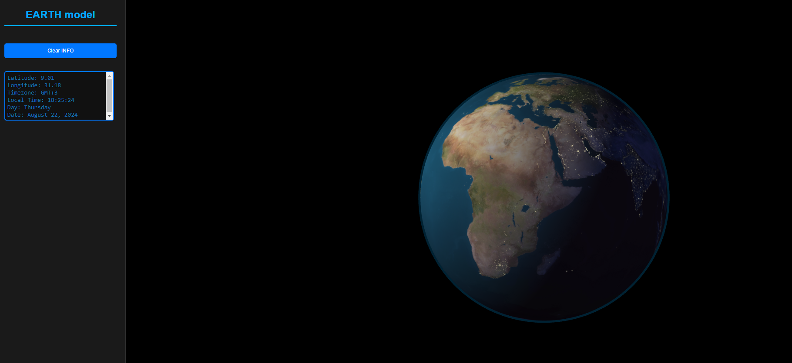

# Globe Module

The Globe module is a dynamic 3D Earth visualization tool that utilizes Three.js for rendering and Turf.js for geospatial operations. It's designed to be both visually engaging and informative, capable of displaying day and night textures, and providing real-time timezone data by interacting with the globe. This module features a realistic tilt to mirror Earth's axial tilt of 23.5 degrees, accurately simulates the planet's rotation speed, and dynamically adjusts the lighting to reflect the true positions of the sun relative to Earth throughout the day and year. 


## Features

- **Dynamic Day/Night Cycle**: Renders Earth with day and night textures that update in real-time according to the sun's position relative to the Earth.
- **Timezone Interaction**: Clicking on the globe will display local time information, adjusted for daylight saving times based on the clicked location. This interaction retrieves and displays geodata, timezone details, as well as the current date and time for the specific location.
- **3D Visualization**: Utilizes Three.js to render a 3D globe with an atmosphere effect for enhanced visual appeal.
- **Real-Time Updates**: The globe rotation and lighting adjust in real-time, providing an accurate representation of the Earth's rotation and sunlight distribution.
- **Customizable Options**: Allows customization of textures, initial start time, and other globe properties.

## Installation

To install the Globe module, you need to include the following dependencies in your project via npm or direct script tags in your HTML:

```bash
npm install three turf
```
Or include these scripts in your HTML:
```
<script src="https://cdn.skypack.dev/three@0.128.0"></script>
<script src="https://cdn.skypack.dev/@turf/turf@7.1.0"></script>
```

```bash
npm install globe-threejs
```

Then, you can import the Globe class in your JavaScript project:
```
import { Globe } from 'https://cdn.skypack.dev/globe-threejs';
```

## Usage
To use the Globe in your project, you need to create a new instance of the Globe and add it to a Three.js scene:

```
const globe = new Globe({
    dayTexture: 'path_to_day_texture.jpg',
    nightTexture: 'path_to_night_texture.jpg',
    onLocationClick: function(info) {
        console.log('Clicked location info:', info);
    }
});

// Initialize a Three.js scene
const scene = new THREE.Scene();
const camera = new THREE.PerspectiveCamera(75, window.innerWidth / window.innerHeight, 0.1, 1000);
const renderer = new THREE.WebGLRenderer();
renderer.setSize(window.innerWidth, window.innerHeight);
document.body.appendChild(renderer.domElement);

// Add the globe to the scene
globe.addToScene(scene);

// Camera and rendering setup
camera.position.z = 15;
function animate() {
    requestAnimationFrame(animate);
    renderer.render(scene, camera);
}
animate();
```

## API Reference
#### Options
When creating a new instance of the Globe, you can pass in an options object to customize its behavior. Below are the available options:

- **dayTexture:** Path to the image file used as the Earth's daytime texture. Default is '../assets/8081_earthmap10k.jpg'.
- **nightTexture:** Path to the image file used as the Earth's nighttime texture. Default is '../assets/8081_earthlights10k.jpg'.
- **startTime:** The initial date and time used to set the globe's lighting and rotation. Default is new Date(), which sets it to the current date and time.
- **earthRadius:** The radius of the globe in Three.js units. Default is 5.
- **onLocationClick:** A callback function that gets executed when a location on the globe is clicked. This function receives an object containing latitude, longitude, timezone, and other relevant data for the clicked location. Default is null.
- **timezoneGeoJSON:** Path to the GeoJSON file that contains timezone information. Default is '../assets/all-timezones_.geojson'.
#### Methods
The Globe class provides several methods to interact with and control the globe:

- **init():** Initializes the globe by loading the necessary resources and setting up the Three.js scene. This method is automatically called upon instance creation.

- **addToScene(scene):** Adds the globe to an existing Three.js scene.
scene: The Three.js scene object to which the globe will be added.

- **setDateTime(date):** Sets the globe's current date and time, affecting lighting and other time-dependent features.
date:A JavaScript Date object representing the new date and time for the globe.

- **update():** Updates the globe's rotation and lighting based on real-time changes. This method is typically called within an animation loop.

- **handleMouseClick(event, camera, domElement):** Handles mouse click events on the globe, performing raycasting to determine the clicked location and executing the onLocationClick callback if specified.
event: The mouse event object.
camera: The Three.js camera object used in the scene.
domElement: The DOM element that the Three.js renderer is attached to.

#### Events
onLocationClick: Triggered when a location on the globe is clicked. Receives an object containing the following 
#### properties:
- **lat:** Latitude of the clicked location.
- **lon:** Longitude of the clicked location.
- **timezone:** Timezone information of the clicked location.
- **localTime:** Local time at the clicked location.
- **localDate:** Local date at the clicked location.